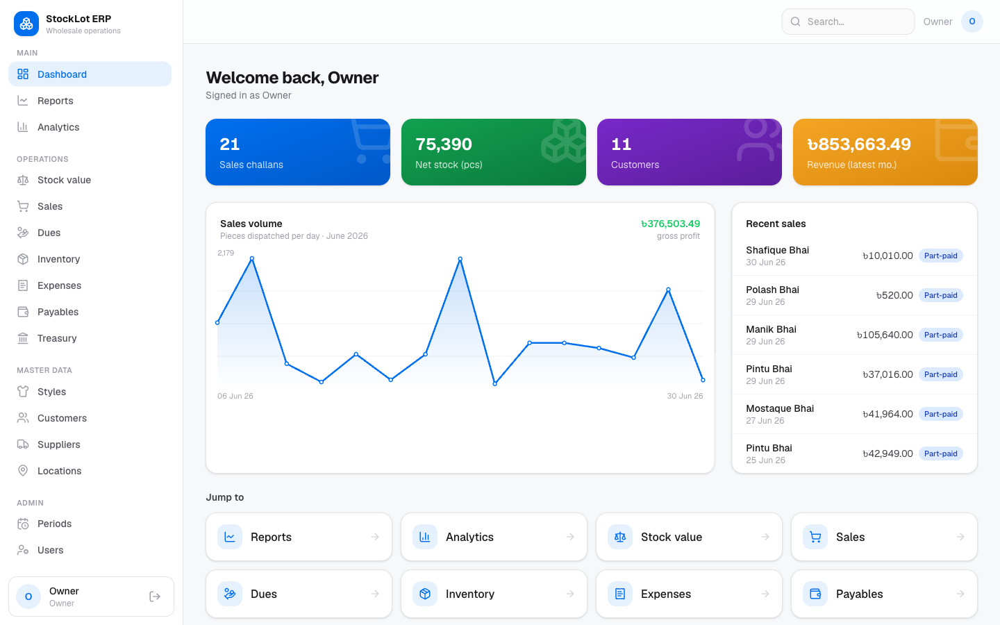
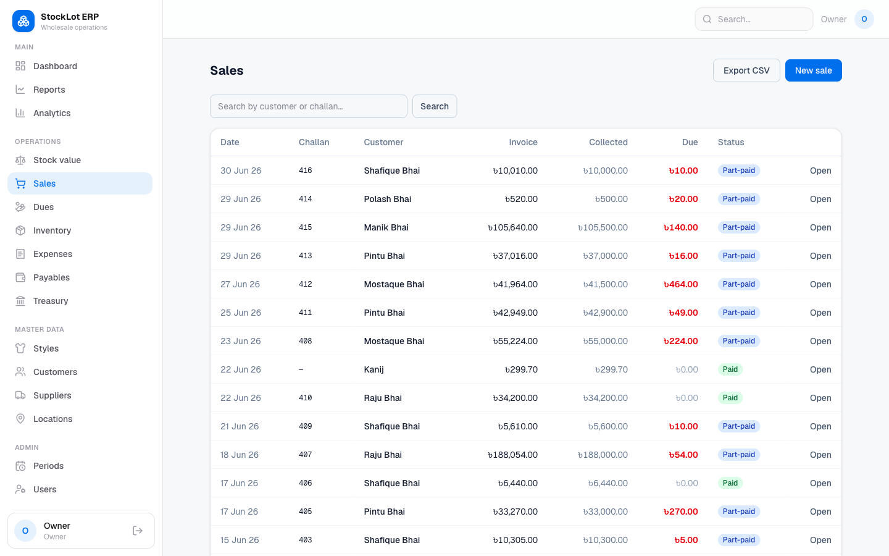
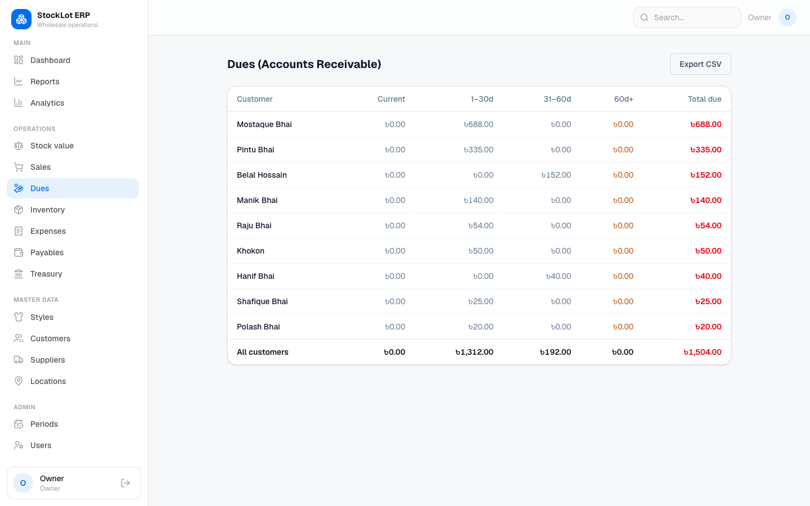
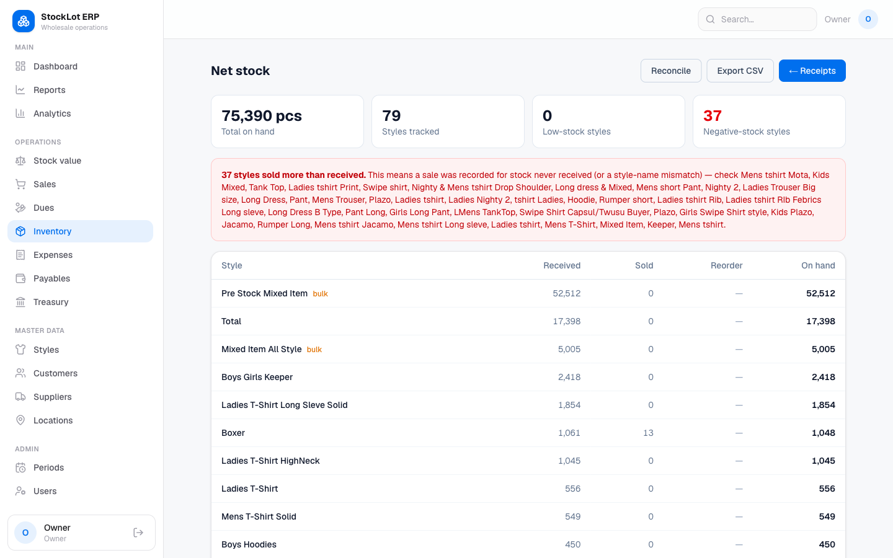
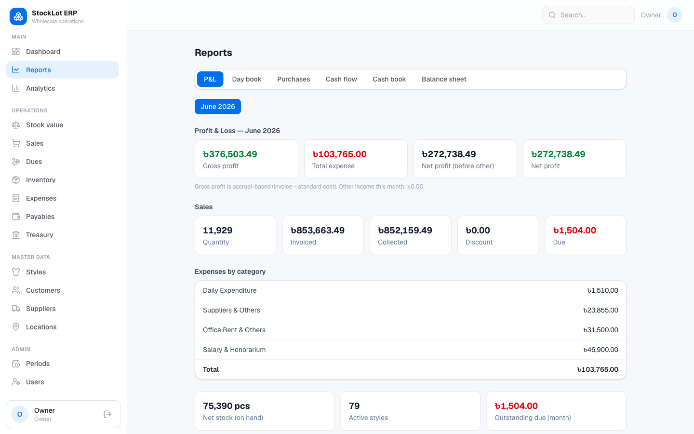
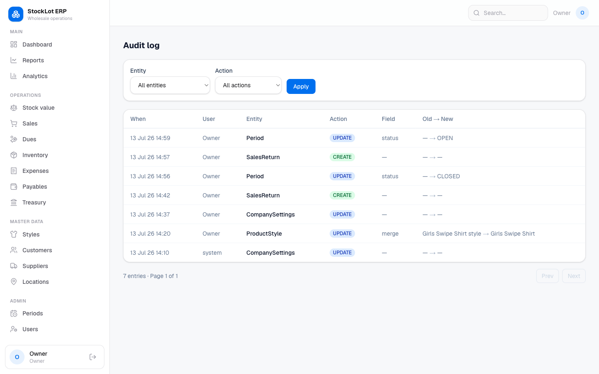

# StockLot ERP

> One source of truth for a StockLot (surplus / overstock lot apparel) wholesale business — sales, dues, inventory, purchases, finance, and reporting in a single web app.

[](https://nextjs.org)
[](https://react.dev)
[](https://www.typescriptlang.org)
[](https://www.prisma.io)
[](https://neon.tech)
[](./LICENSE)
[](https://github.com/bemoshiur/StockLot-ERP-/actions/workflows/ci.yml)

StockLot ERP is a collaborative, multi-user web ERP for a Bangladeshi surplus/overstock lot apparel wholesale business. It gives a small team (3–8 people) one shared, always-live source of truth for master data, sales, receivables, inventory, purchases, expenses, treasury, and automatic profit/summary reporting. It is built for phones on the market floor or in the warehouse and for desktops in the office, in English, with all figures in BDT (৳).

**Live demo:** <https://stock-lot-erp.vercel.app>

## Why

A growing wholesale business was run entirely from a single, fragile shared Excel workbook rebuilt every month. The same sale had to be typed three times, product costs were hardcoded and drifted out of date, there was no live stock position, and no audit trail of who changed what. StockLot ERP replaces that workbook with one collaborative system: enter a sale once and dues, stock, and the monthly P&L all update together, every write is validated and audit-logged, and the numbers reconcile back to the source figures to the taka.

## Features

Every module below is shipped and live.

### Master data

- Garment **styles** with per-style standard cost, free-text aliases, and reconciliation/merge
- **Customers**, **suppliers**, and **locations**
- **Users** with role-based access control
- Company profile / letterhead

### Sales & receivables

- **Sales challans** with a full lifecycle: `DRAFT → DISPATCHED → PARTIALLY_PAID → PAID` (plus `VOID`)
- **Payment receipts** with discount / waiver handling
- **Dues** (accounts receivable) with aging buckets: current, 1–30, 31–60, 60+
- **Sales returns** with printable credit notes
- Per-customer **statement / khata**

### Inventory

- **Goods-received notes** (GRN) and live net stock
- **Stock valuation** at standard cost
- **Stock adjustments**: count correction, damage, loss, found
- **Purchase returns** to supplier
- **Reorder levels** with low-stock alerts

### Purchases & payables

- **Purchase receipts** with bill amounts
- **Accounts payable** by supplier and **supplier payments**
- Month-end **period close / lock**

### Finance

- Monthly **P&L**
- **Expenses** by category (advances excluded from period cost)
- **Treasury & partner-capital** tracking
- **Cash flow** and a chronological **cash book** with running balance
- **Balance sheet** / statement of financial position

### Reporting & analytics

- **Dashboard** with KPI cards and charts
- **Sales analytics**: by location, top items, top customers, daily revenue
- **Reports pack**: day book, purchases report, cash flow, cash book, balance sheet
- **Printable documents** (challan/invoice, GRN, credit note) on the company letterhead
- **CSV / Excel export** and an Excel / CSV **importer**

### Platform

- **Global search** and a full **audit log**
- One-click **JSON data backup** (owner/admin)
- Installable **PWA** with an offline fallback
- **Bulk actions** (e.g. bulk activate/deactivate styles)

## Tech stack

- **Next.js 16.2.10** — App Router, React Server Components, one full-stack TypeScript codebase (Next 16 renames the middleware convention to *proxy*, `src/proxy.ts`)
- **React 19.2.4**
- **Prisma 6.19.3** ORM on **PostgreSQL** (Neon, `ap-southeast-1` / Singapore) — pooled `DATABASE_URL` at runtime, non-pooled `DIRECT_URL` for migrations
- **Auth.js / NextAuth v5** (`5.0.0-beta.31`) — credentials provider, JWT sessions carrying the user role, edge-safe split (`auth.config.ts` + `auth.ts`)
- **Tailwind CSS v4** (`@theme` tokens), light-mode NextUI-inspired design
- **Framer Motion** page transitions, **lucide-react** icons, dependency-free SVG charts
- **Zod 4** validation on every server action, **bcryptjs** password hashing, **@e965/xlsx** (a patched, CVE-free fork of `xlsx`) for Excel import/export
- **Vitest** — 51 unit tests over pure domain logic
- **pnpm** package manager, deployed on **Vercel** (region `sin1`, co-located with Neon)

Money is handled with `Decimal` plus a `roundMoney()` helper (no float drift), enums are modeled as validated `String` columns for portability, and months can be **locked** so writes to a closed period are refused.

## Screenshots

A tour of the live app (light mode). More in [`docs/screenshots/`](./docs/screenshots/).

| Dashboard | Sales challan | Dues aging |
| --- | --- | --- |
|  |  |  |

| Inventory | Reports pack | Audit log |
| --- | --- | --- |
|  |  |  |

## Quick start

```bash
git clone https://github.com/bemoshiur/StockLot-ERP-.git
cd StockLot-ERP-
cp .env.example .env          # set DATABASE_URL, DIRECT_URL, AUTH_SECRET
pnpm install                  # postinstall runs `prisma generate`
pnpm prisma migrate deploy    # apply migrations
pnpm db:seed                  # owner login + reference master data
pnpm dev                      # http://localhost:3000
```

**Default seeded login:** `owner@stocklot.local` / `changeme123`

> ⚠️ **Security:** change this password immediately after your first sign-in.

## Run with Docker

A standalone image is published to the GitHub Container Registry:

```bash
docker run -p 3000:3000 \
  -e DATABASE_URL="postgres://…" \
  -e DIRECT_URL="postgres://…" \
  -e AUTH_SECRET="your-secret" \
  ghcr.io/bemoshiur/stocklot-erp-:latest
```

## Roles & permissions

A central capability matrix `can(role, action)` in `src/lib/rbac.ts` gates navigation and **every server action** before any read or write; `src/proxy.ts` gates routes at the edge.

| Role | What they can do |
| --- | --- |
| **OWNER** | Full access, including data backup |
| **PARTNER** | Full operational and financial visibility |
| **SALES** (Sales Operator) | Manage customers, locations, sales, receipts, and dues — *cannot* touch the style master, suppliers, or users |
| **INVENTORY** (Inventory Clerk) | Manage stock, GRNs, and adjustments |
| **ACCOUNTANT** | Finance, expenses, payments, and reporting |
| **ADMIN** | User and system administration |

## Testing

```bash
pnpm test        # vitest — 51 unit tests over pure domain logic
pnpm typecheck   # tsc --noEmit
pnpm lint        # eslint
```

Unit tests cover the pure, side-effect-free domain logic in `src/lib/` (sales, inventory, finance, ledger, aging, RBAC, audit). The `pnpm import:june26` script loads the source workbook and prints an ERP-vs-XLS reconciliation to confirm the system reproduces the original figures to the taka.

## Project structure

```
src/
  app/                 # App Router pages, layouts, API routes, print views
  proxy.ts             # Next 16 edge middleware (route gating)
  auth.config.ts       # edge-safe auth config
  auth.ts              # NextAuth setup
  lib/                 # pure, unit-tested domain logic
    rbac.ts            # can(role, action) capability matrix
    guards.ts          # requireCan() / requireUser()
    audit.ts           # writeAudit() / diff()
    sales.ts inventory.ts finance.ts ledger.ts aging.ts period.ts queries.ts
    validators/        # Zod schemas per module
  components/          # shared UI primitives
prisma/                # schema.prisma (26 models), migrations, seed, import scripts
```

## Documentation

- [docs/ARCHITECTURE.md](./docs/ARCHITECTURE.md) — system design and patterns
- [docs/DEPLOYMENT.md](./docs/DEPLOYMENT.md) — Vercel and Docker deployment
- [docs/ROADMAP.md](./docs/ROADMAP.md) — what's planned next
- [CONTRIBUTING.md](./CONTRIBUTING.md) — how to contribute
- [SECURITY.md](./SECURITY.md) — reporting vulnerabilities
- [CHANGELOG.md](./CHANGELOG.md) — release history

## Roadmap

See [docs/ROADMAP.md](./docs/ROADMAP.md). Highlights on deck: a **double-entry general ledger**, **scheduled backups**, and an **offline write queue**.

## Contributing

Contributions are welcome — start with [CONTRIBUTING.md](./CONTRIBUTING.md).

## License

Released under the [MIT License](./LICENSE).
